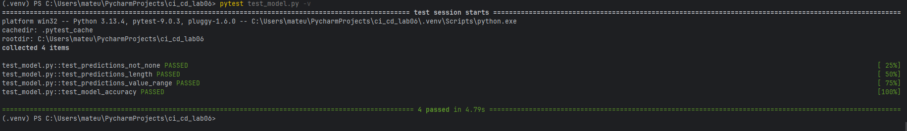
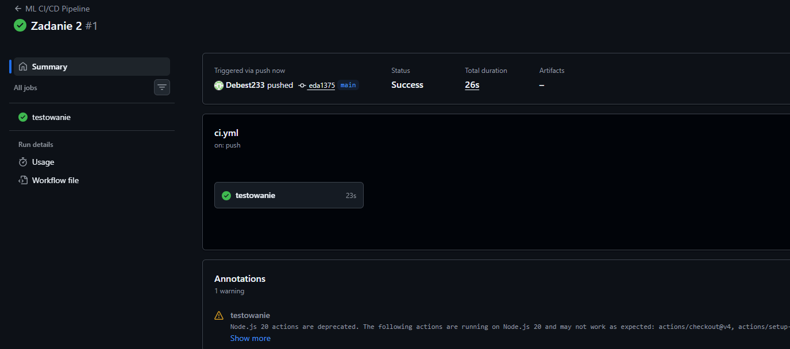
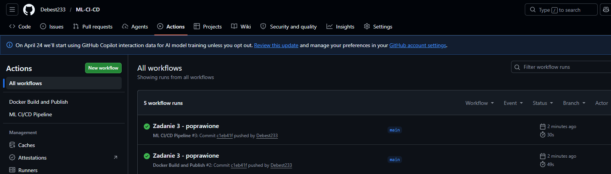
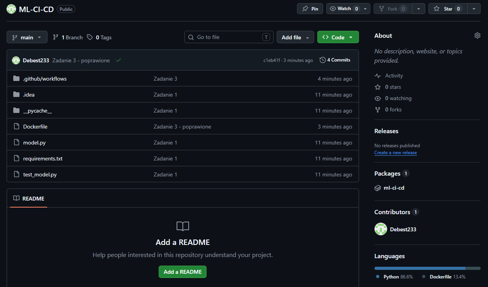
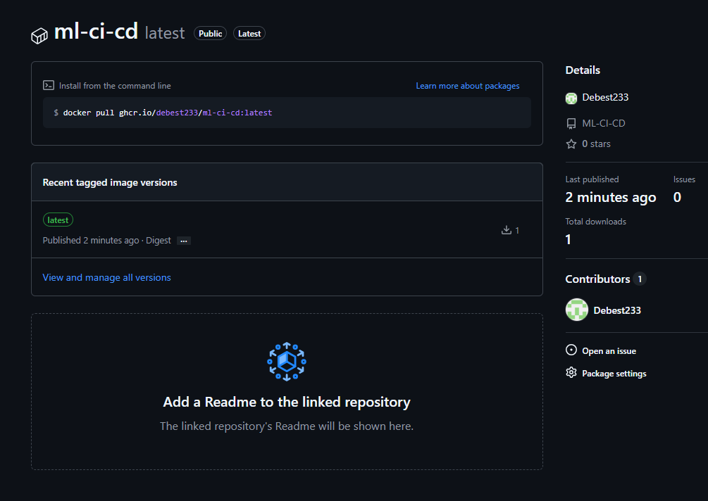

# Laboratorium 06 - CI/CD i testowanie modelu ML (GitHub Actions)

Repozytorium zawiera rozwiązanie zadań z Laboratorium 6.

## Wykonane zadania

### Zadanie 1: Testy jednostkowe (pytest)
W projekcie zaimplementowano model uczenia maszynowego wytrenoway na zbiorze Iris. Napisano testy jednostkowe sprawdzające poprawność predykcji, wymiary zwracanych tablic, dopuszczalny zakres klas oraz minimalną wymaganą dokładność modelu (accuracy >= 70%).

**Zrzut ekranu z wykonania testów:**

---

### Zadanie 2: Ciągła Integracja (Automatyzacja testów)
Skonfigurowano `ML CI/CD Pipeline` w pliku `.github/workflows/ci.yml`. Przy każdym wypchnięciu kodu na gałąź `main`, GitHub Actions automatycznie stawa maszynę wirtualną z systemem Ubuntu, instaluje zaleznosci i uruchamia testy w izolowanym środowisku.

**Zrzut ekranu z pomyślnego wykonania potoku testowego:**

---

### Zadanie 3: Automatyczny build obrazów Docker (GHCR)
Skonfigurowano `Docker Build and Publish` w pliku `.github/workflows/docker.yml`. Srodowisko CI automatycznie buduje obraz kontenera z aplikacją na podstawie załączonego pliku `Dockerfile` i po udanym zbudowaniu, publikuje go jako pakiet w rejestrze GitHub Container Registry (ghcr.io).

**Widok pomyślnie wykonanego potoku Docker Build:**

**Widok opublikowanego obrazu w sekcji Packages:**

**Widok opublikowanego obrazu w sekcji Packages:**
